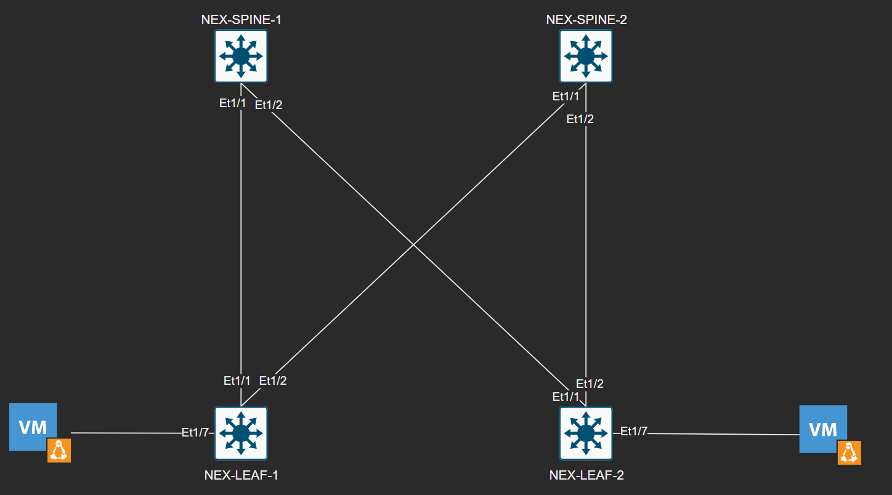

# Ansible VXLAN

An ansible playbook to provision VXLAN + MP-BGP EVPN using IP unnumbered with OSPF and PIM SM in the underlay. iBGP EVPN is used as the control plane and we are simulating this in virtualized environment using EVE-NG with the following topology: 



## Instructions

This lab was tested using NKOSv9K-9.2.2 devices on EVE-NG. DHCP was enabled on the mgmt0 interfaces of each devices for reachability. I used a script to bootstrap the automatic discovery and configuration of the hosts DHCP IP address https://github.com/ttl0/eveng-bootstrap

1. Update the hosts file with the proper IP addresses to reach each mgmt0
interfaces (you can use the bootstrap script at the github repo above). If you
use the script, you will still need to identify which device names are leafs
and which ones are spines.
2. Update the group_vars/all.yml file with the proper username/password. I'm
using admin/admin for this example.
3. Make sure you have paramiko installed. 
```
pip3 install paramiko --user
```
4. Install the cisco.nxos module if you don't have it. 
```
ansible-galaxy collection install cisco.nxos
```
The playbook was tested with version 1.4.0 of the cisco.nxos module

3. Run the playbook 
```
ansible-playbook site.yml
```
The playbook was testing with version Ansible version 2.9.6
